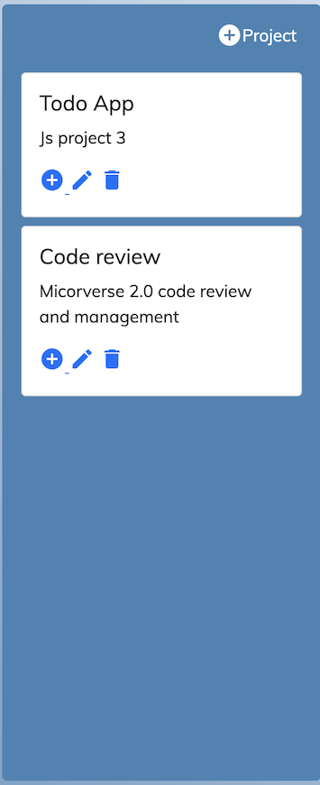
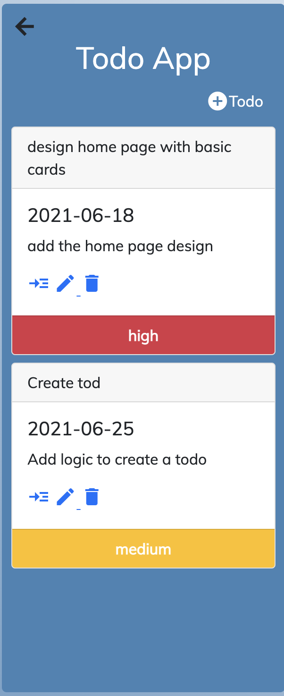

# Todo App

## App

## About

This is a basic todo app. That allows the user to create a project and add a list of activities (todos) to it.
The program starts with a default project in which a user can add todo to it using the plus sign.
A todo just contain title, description and priority.

## Built With

- Javascript
- Bootstrap 5
- Html
- Webpack

### Prerequisites

Knowledge about JS:

- Basic data structures
- Loops
- Arrays
- Functions
- Constructors
- Rendering HTML in JS file
- JS injection
- Knownledge of webpack

## Clone project

- To get a local copy up and running follow these simple example steps.
- Clone this repository with git clone https://github.com/nganifaith/JS_ToDOList.git using your terminal or command line.
- Change to the project directory by entering: cd JS_ToDoList in the terminal.

## Command line steps

- $ git clone `$ git clone https://github.com/nganifaith/JS_ToDOList.git
- $ git checkout feature
- $ cd JS_ToDoList

## Start App

- run `npm install`
- run `npm start` in your command line

## Live Site

[Link](https://silly-colden-09da2e.netlify.app/#)

## Author

👤 **Ngani Faith**

- GitHub: [@nganifaith](https://github.com/nganifaith)
- Twitter: [@Bright_Ngani](https://twitter.com/bright_ngani)
- LinkedIn: [Ngani Faith](https://www.linkedin.com/in/ngani-faith/)

## 🤝 Contributing

Contributions, issues, and feature requests are welcome!

Feel free to check the [issues page](https://github.com/nganifaith/JS_ToDOList/issues).

## Show your support

Give a ⭐️ if you like this project!

## 📝 License

This project is [MIT](https://choosealicense.com/licenses/mit/) licensed.
